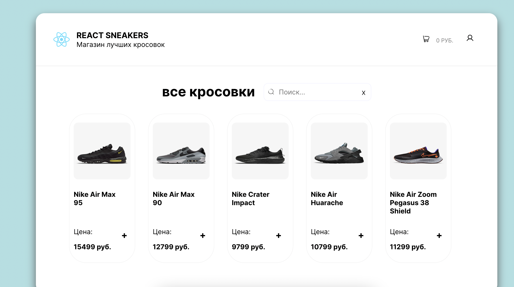

<h1 align="center">
    
</h1>

# react-sneakers

Ссылка на проект в gh-pages: **[react-sneakers](https://norv139.github.io/react-sneakers/)**

## Описание:

  Проект магазин кроссовок, созданный для закреплению знаний по React и Redux

## Стэк:

&nbsp;
&nbsp;
&nbsp;
&nbsp;
&nbsp;

## Задачи:
  Переписать весь код с JS на TS
 
## Установка:

##### `npm install` – установить зависимости проекта

##### `npm start` – запуск devServer на http://localhost:3000/

##### `npm build` – production сборка проекта
